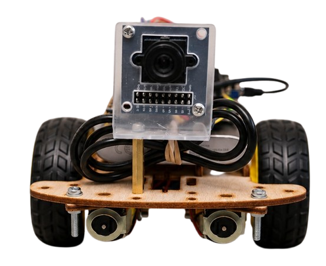
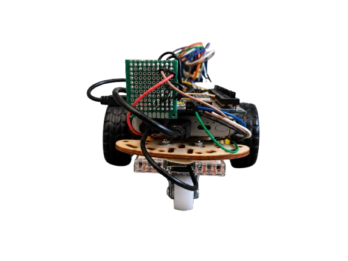
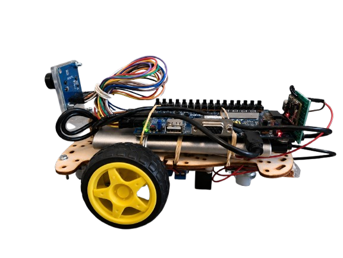
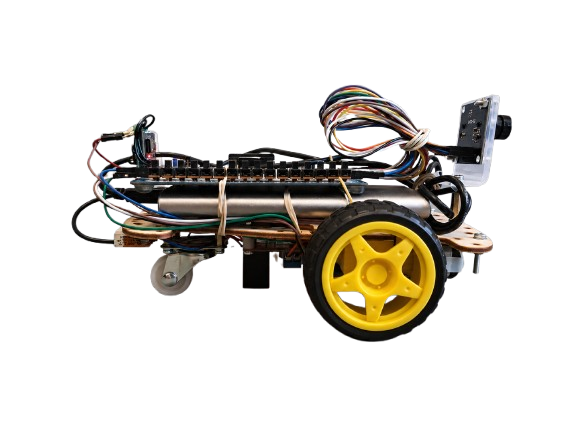
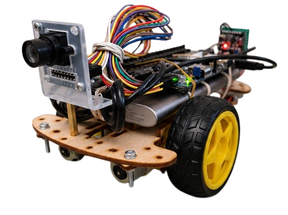
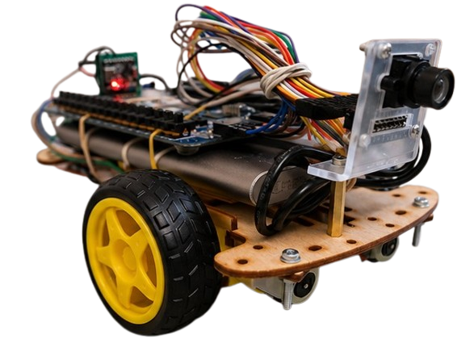
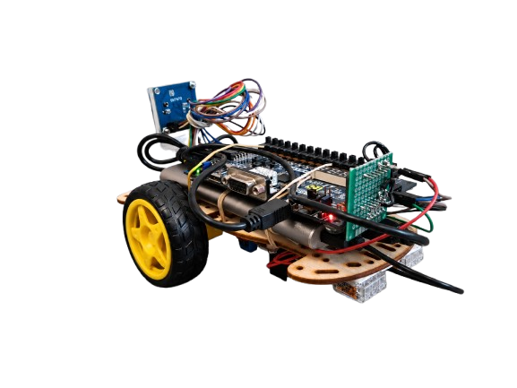
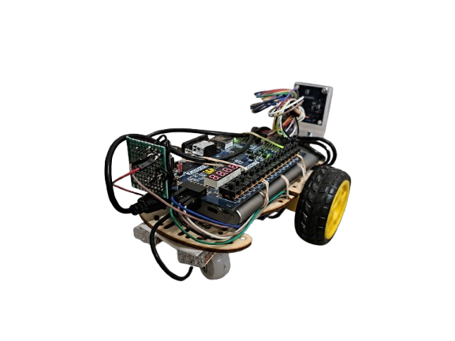
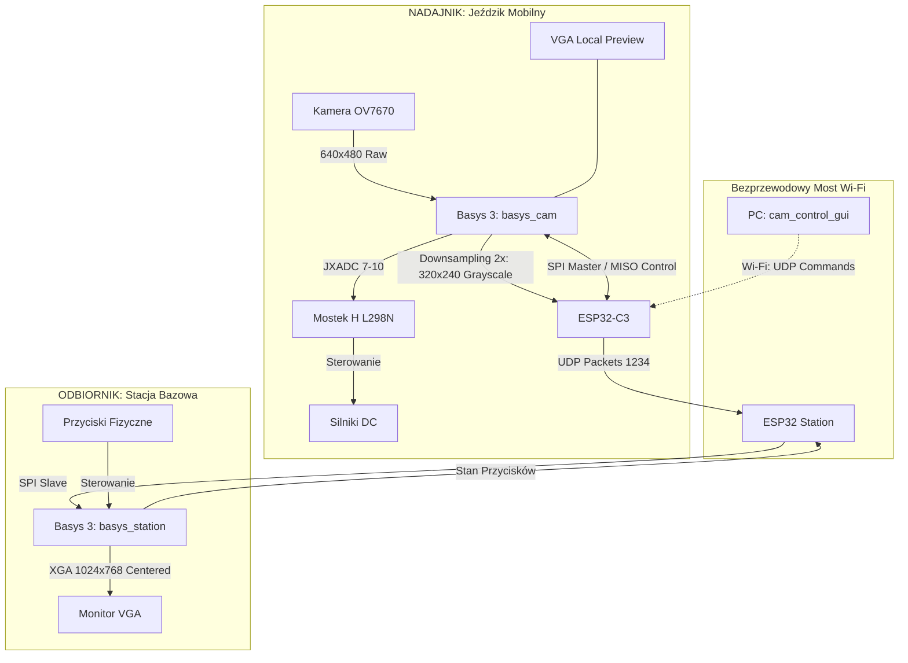

# Bezprzewodowy System Transmisji Wideo i Sterowania (Basys 3 + ESP32)

<p align="center">
  
</p>

Projekt akademicki realizowany w ramach przedmiotu **MTM UEC2** na **Akademii Górniczo-Hutniczej (AGH)**. 

System umożliwia bezprzewodowy przesył obrazu z kamery **OV7670** zamontowanej na mobilnej platformie kołowej ("Jeździku") za pośrednictwem mostu **Wi‑Fi (2x ESP32)** na stacjonarną płytkę **Basys 3**, która wyświetla obraz na monitorze **VGA**. Dodatkowo system zapewnia pełne dwukierunkowe sterowanie napędem robota (mostek **L298N**) za pomocą aplikacji PC (GUI/UDP) lub przycisków na stacji odbiorczej.

---

## 📸 Galeria Konstrukcji Robota

Poniżej przedstawiono zdjęcia zmontowanego robota mobilnego ("Jeździka") z różnych perspektyw:

| Przód (Kamera OV7670 & sensory) | Tył (Napęd i zasilanie) |
|:---:|:---:|
|  |  |
| **Profil Lewy** | **Profil Prawy** |
|  |  |
| **Lewy Przód** | **Prawy Przód** |
|  |  |
| **Lewy Tył** | **Prawy Tył** |
|  |  |

---

## 🛠️ Architektura Systemu

System składa się z dwóch głównych węzłów komunikujących się bezprzewodowo za pomocą protokołu UDP w sieci Wi-Fi:



### 1. Nadajnik (`basys_cam`):
* Przechwytuje obraz z kamery **OV7670** w rozdzielczości 640x480.
* Dokonuje sprzętowego downsamplingu 2x w module [ov7670_capture.sv](file:///c:/Users/Vmagic/Desktop/Jezdzik_readyy_aaa/uec_projekt_wireless_camera_transfer/basys_cam/rtl/ov7670_capture.sv) do rozmiaru **320x240** (skala szarości, 8-bit, 76 800 bajtów/klatkę).
* Zapisuje klatkę do bufora ramki BRAM i przesyła ją magistralą SPI do modułu **ESP32-C3** na robocie.
* Steruje silnikami za pomocą mostka H **L298N** na podstawie odebranych z ESP32 (przez SPI MISO) komend ruchu.

### 2. Bezprzewodowa transmisja (ESP32):
* **ESP cam** (`main_cam.cpp`) odbiera dane z FPGA przez SPI i wysyła je pakietami UDP (75 pakietów po 1024 bajty danych wideo + nagłówek) do stacji bazowej. Odbiera również komendy kierunku jazdy z komputera lub stacji i odsyła je do FPGA przez SPI MISO.
* **ESP station** (`main_station.cpp`) odbiera pakiety UDP, składa je w ramki i wysyła magistralą SPI do stacji FPGA. Jednocześnie odczytuje stan przycisków stacji i wysyła je bezprzewodowo z powrotem.

### 3. Odbiornik (`basys_station`):
* Odbiera ramki przez SPI i zapisuje je do bufora ramki BRAM.
* Renderuje obraz na monitorze **VGA** w rozdzielczości **1024x768 @ 60Hz** (obraz z kamery jest centrowany, skalowany i obrócony o 90 stopni, co odpowiada bocznej orientacji kamery na robocie).

---

## 📂 Zawartość Repozytorium

| Katalog / Plik | Rola |
|:---|:---|
| 📂 [`basys_cam/`](basys_cam/) | Nadajnik FPGA: akwizycja wideo, bufor, SPI master, wyjścia silników, lokalne VGA. |
| 📂 [`basys_station/`](basys_station/) | Odbiornik FPGA: SPI slave, bufor ramki BRAM, wyjście VGA na monitor. |
| 📂 [`uec_projekt_esp32/`](uec_projekt_esp32/) | Oprogramowanie PlatformIO dla ESP32-C3 (kamery) i ESP32 (stacji) — obsługa UDP i DMA SPI. |
| 📂 [`cam_control_gui/`](cam_control_gui/) | Aplikacja sterująca na komputer (Python + tkinter) — wysyłanie rozkazów jazdy po UDP. |
| 📂 [`tools/`](tools/) | Skrypty do kompilacji, programowania i konfiguracji płytek. |

---

## 🔌 Połączenia Sprzętowe

### 1. Porty SPI (JA Pmod) na obu płytkach Basys 3

| Sygnał | Basys 3 Pin | ESP32 GPIO | Opis |
|:---|:---:|:---:|:---|
| **SPI CS** | **JA1** | **GPIO7** | Chip Select (Aktywny w stanie niskim) |
| **SPI MOSI**| **JA2** | **GPIO6** | Dane wideo z FPGA do ESP (nadajnik) / z ESP do FPGA (odbiornik) |
| **SPI MISO**| **JA3** | **GPIO5** | Komendy sterujące z ESP do FPGA (nadajnik) / z FPGA do ESP (odbiornik) |
| **SPI SCK** | **JA4** | **GPIO4** | Zegar magistrali SPI |
| **GND** | **GND** | **GND** | Wspólna masa (Krytyczna dla stabilności sygnałów!) |

### 2. Połączenie Mostka H L298N do `basys_cam` (JXADC)

| JXADC Pin | FPGA Port | Sygnał L298N | Opis działania |
|:---:|:---:|:---:|:---|
| **JXADC 7** | `motor_in[0]` | **IN1** | Kierunek silnika 1 (Lewa strona) |
| **JXADC 8** | `motor_in[1]` | **IN2** | Kierunek silnika 1 (Lewa strona) |
| **JXADC 9** | `motor_in[2]` | **IN3** | Kierunek silnika 2 (Prawa strona) |
| **JXADC 10**| `motor_in[3]` | **IN4** | Kierunek silnika 2 (Prawa strona) |

> [!NOTE]
> Piny ENA i ENB mostka L298N powinny być podłączone na stałe do napięcia +5V za pomocą zworki w celu uzyskania maksymalnej prędkości obrotowej (brak sterowania PWM w bieżącej wersji FPGA). Więcej informacji w dedykowanym opisie: [`basys_cam/docs/MOTOR_L298N.md`](basys_cam/docs/MOTOR_L298N.md).

---

## 🚀 Szybki Start

Przed uruchomieniem komend załaduj środowisko narzędziowe (w terminalu Git Bash lub Linux):
```bash
source env.sh
```

### 1. Synteza i Wgranie FPGA
Wygeneruj bitstreamy dla obu projektów i wgraj je za pomocą JTAG:

**Dla Nadajnika (Robot):**
```bash
generate_bitstream_basys basys_cam
program_basys basys_cam basys15
```

**Dla Odbiornika (Stacja bazowa):**
```bash
generate_bitstream_basys basys_station
program_basys basys_station basys16
```
*(Numery seryjne programatorów `basys15`/`basys16` należy wcześniej wpisać w pliku `tools/board_config.sh`)*.

### 2. Kompilacja i Wgranie ESP32
Za pomocą PlatformIO skompiluj i prześlij programy na moduły ESP32 podłączone pod odpowiednie porty szeregowe COM:
```bash
program_esp main_cam.cpp COM10
program_esp main_station.cpp COM14
```

### 3. Konfiguracja sieci Wi-Fi i Uruchomienie Streamu
1. Po włączeniu zasilania moduł ESP stacji utworzy tymczasowy punkt dostępowy o nazwie **`ROBOT_SETUP`** (hasło: `robotsetup`).
2. Połącz się komputerem lub telefonem z tą siecią i za pomocą aplikacji sterującej prześlij docelowe dane logowania do swojej domowej sieci Wi-Fi.
3. Po zrestartowaniu, oba moduły ESP połączą się z wybraną siecią. Obraz z kamery pojawi się automatycznie na monitorze VGA podpiętym do płytki odbiorczej.

### 4. Sterowanie robotem

Sterowanie pojazdem mobilnym (Jeździkiem) może odbywać się na dwa sposoby:

#### A. Dedykowana Aplikacja Mobilna & Desktopowa (Flutter)
W folderze [`Jezdzik_do_pobrania/`](Jezdzik_do_pobrania/) przygotowano gotowe pakiety instalacyjne aplikacji sterującej na systemy Android oraz Windows:
* **Android**: Plik instalacyjny [`Jezdzik.apk`](Jezdzik_do_pobrania/Jezdzik.apk). Podczas instalacji system telefonu może poprosić o zezwolenie na instalację aplikacji spoza sklepu Google Play.
* **Windows**: Archiwum [`Jezdzik_Windows.zip`](Jezdzik_do_pobrania/Jezdzik_Windows.zip). Po rozpakowaniu należy uruchomić plik `jezdzik.exe` (pamiętaj, aby nie przenosić samego pliku `.exe` bez dołączonych bibliotek `.dll` oraz katalogu `data`).

#### B. Aplikacja PC Python (GUI)
Alternatywnie, na komputerze podłączonym do tej samej sieci Wi-Fi co robot, można uruchomić lekki skrypt sterujący w Pythonie:
```bash
python cam_control_gui/cam_control_gui.py
```
* **Sterowanie**: Użyj klawiszy **strzałek** lub klawiszy **W, S, A, D** w celu poruszania się.
* Puszczenie klawisza powoduje natychmiastowe zatrzymanie (wysłanie ramki **stop** do robota).

---

## 🛠️ Informacje o Taktowaniu (Timing)
W projektach wyłączono analizę ścieżki przejścia między domenami zegarowymi `safe_start_reg` (CDC z 65 MHz do 40 MHz) za pomocą reguły `set_false_path` w plikach `.xdc`. Zapewnia to pomyślne przejście weryfikacji czasowej (Timing Constraints Met) przy zachowaniu pełnej stabilności i bezpieczeństwa startu układów.
