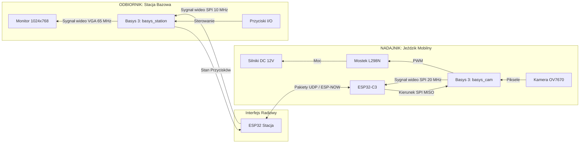

# Bezprzewodowy System Transmisji Wideo i Sterowania (Basys 3 + ESP32)

<p align="center">
  
</p>

Projekt akademicki realizowany w ramach przedmiotu **MTM UEC2** na **AGH**. Jest to rozproszony układ sprzętowo-programowy implementujący bezprzewodową transmisję obrazu z ruchomej platformy na stację bazową z interfejsem VGA. System wykorzystuje mikrokontrolery ESP32 jako most radiowy pracujący w architekturze UDP.

---

## 📸 Galeria Konstrukcji
Poniżej przedstawiono zdjęcia zmontowanego robota mobilnego ("Jeździka") z różnych perspektyw:

| Przód (Kamera OV7670 & sensory) | Tył (Napęd i zasilanie) |
|:---:|:---:|
|  |  |
| **Profil Lewy** | **Profil Prawy** |
|  |  |
| **Lewy Przód** | **Prawy Przód** |
|  |  |
| **Lewy Tył** | **Prawy Tył** |
|  |  |

---

## 1. Architektura Systemu

System zbudowany jest z dwóch niezależnych platform deweloperskich Digilent Basys 3 połączonych radiowo z wykorzystaniem ESP32-C3 / ESP32, działających w topologii punkt-punkt (ESP-NOW / UDP).



### Specyfikacja podzespołów sprzętowych:
1. **Moduł Kamery (`basys_cam`)**: Pobiera dane wejściowe w rozdzielczości 640x480 (PCLK: 10 MHz). Logika FPGA wykonuje downsampling do rozmiaru 320x240 w 8-bitowej skali szarości. Integracja domen zegarowych (CDC) ze środowiska kamery do domeny systemowej (40 MHz) odbywa się asynchronicznie poprzez instancję Xilinx XPM FIFO. Gotowe dane przesyłane są magistralą SPI. 
2. **Most Radiowy (`uec_projekt_esp32`)**: Kod bazujący na FreeRTOS z obsługą DMA dla SPI. Implementuje sprzętowe kolejkowanie i dzieli strukturę wejściową klatek wideo na mniejsze pakiety protokołu UDP, przesyłając je drogą bezprzewodową, a w locie powrotnym odsyła komendy mechanizmu napędowego układu jezdnego.
3. **Moduł Stacji (`basys_station`)**: Działa jako SPI Master z taktowaniem magistrali 10 MHz. Odpytuje ESP32 stacji za pomocą sekwencji synchronizującej `0xCAFE`. Odczytane paczki wideo trafiają pod adresację bufora Dual-Port BRAM z oddzielnym zegarem odczytu `65 MHz`. Moduł synchronizacji obrazu realizuje w locie stałą rotację tekstury o 90 stopni i sprzętowe skalowanie x2.13 dopasowując sygnał pod standard XGA 1024x768 60 Hz.

---

## 2. Mapa Repozytorium

| Katalog | Opis zawartości |
|:---|:---|
| [`basys_cam/`](basys_cam/) | Kod źródłowy (RTL) modułu wysyłającego obraz i układu FSM SPI. |
| [`basys_station/`](basys_station/) | Kod źródłowy (RTL) modułu odbiorczego, BRAM, i syntezy VGA. |
| [`uec_projekt_esp32/`](uec_projekt_esp32/) | Oprogramowanie C++ mikrokontrolerów pod PlatformIO. |
| [`cam_control_gui/`](cam_control_gui/) | Oprogramowanie klienckie Python do kontroli ruchu PC. |
| [`doc/`](doc/) | Dokumentacja końcowa, raport, checklisty MTM. |
| [`tools/`](tools/) | Skrypty powłoki automatyzujące tworzenie i wgrywanie bitstreamu. |

---

## 3. Parametry Interfejsu Sprzętowego
Poniżej zestawienie głównych linii transmisyjnych interfejsu Pmod (Złącza JA).

### Magistrala SPI
| Basys 3 Pin | Rola sygnałowa | Konfiguracja I/O | Przepustowość |
|:---:|:---|:---:|:---:|
| **JA1** | Chip Select (CS_N) | Active Low | - |
| **JA2** | MOSI (Master Out) | Odtwarzanie wideo / Tx | - |
| **JA3** | MISO (Master In) | Dane wejściowe przycisków / Rx | - |
| **JA4** | Zegar SCK | Typ. 10 - 20 MHz | do ~25 FPS |
| **GND** | Wspólna Masa | Konieczne domknięcie obwodu! | - |

*(W celu uzyskania informacji dotyczących sterownika mocy DC L298N przypiętego pod złącze `JXADC`, zapoznaj się z odpowiednią sekcją dokumentacji układu [doc/raport_modulow.md](doc/raport_modulow.md).)*

---

## 4. Budowa i Kompilacja (Build System)

System wspiera pełną automatyzację przez zbiór skryptów `.sh` wywołujących Vivado w trybie CLI (TCL Batch Mode). W celu uruchomienia syntezy wejdź do katalogu głównego w środowisku Bash.

**Krok 1. Ładowanie środowiska**
Wymagane do dołączenia ścieżek globalnych i lokalnego katalogu `tools`:
```bash
source env.sh
```

**Krok 2. Synteza / Implementacja FPGA**
Generuje konfigurację bitstream:
```bash
./tools/generate_bitstream_basys.sh basys_cam
./tools/generate_bitstream_basys.sh basys_station
```

**Krok 3. Wgrywanie układu testowego**
Ładuje projekt bezpośrednio do pamięci ulotnej (RAM) FPGA. Jako drugi argument wymagane jest ID JTAG przypisane do danego programatora USB, skonfigurowane uprzednio w `tools/board_config.sh`:
```bash
./tools/program_basys.sh basys_cam basys15
./tools/program_basys.sh basys_station basys16
```

**Krok 4. Programowanie Trwałe QSPI Flash (Opcjonalnie)**
Pozwala na utrwalenie bitstreamu `.bin` do pamięci stałej płyty i samoczynny zapłon układów po ponownym uruchomieniu zasilania bez wsparcia PC:
```bash
./tools/program_qspi_basys.sh basys_cam basys15
./tools/program_qspi_basys.sh basys_station basys16
```

---

## 5. Sterowanie i Aplikacje Klienckie

Platforma obsługuje zdalne sterowanie przy użyciu sieci Wi-Fi i gniazd UDP. Możliwe są dwie opcje łączenia:
1. **Gotowe skrypty PC**: W katalogu `cam_control_gui/cam_control_gui.py` znajduje się referencyjny program do kierowania platformą z użyciem klawiszy WASD lub strzałek na klawiaturze.
2. **Platforma Mobilna**: Skompilowane instalatory (pakiety `.apk` dla Android i `.zip` na platformę Windows) dostępne są w katalogu głównym `Jezdzik_do_pobrania/`.

---

## 6. Raporty Timingu
Aplikacja przechodzi weryfikację czasową bez generowania błędów krytycznych (Setup/Hold met). Zastosowano ograniczenia `set_false_path` izolujące ścieżki przejść domen zegarowych między rejestrami konfiguracyjnymi a pętlą PLL. Wykluczone z syntezy porty wejściowe w bloku `vga_frame_renderer` zakwalifikowano jako nieużywane przestrzenie gotowe na implementację interfejsu graficznego (HUD).
