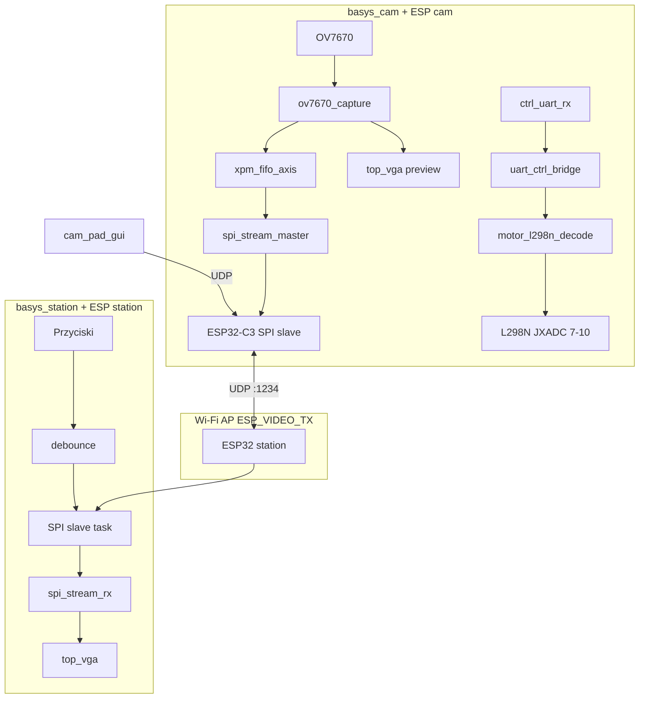

# Analiza techniczna projektu — ściąga do dokumentacji

Dokument opisuje **cały** repozytorium `uec_projekt_wireless_camera_transfer`: architekturę, każdy moduł FPGA, firmware ESP32, skrypty i aplikację PC. Możesz kopiować rozdziały do raportu / README / prezentacji.

---

## Spis treści

1. [Cel i przepływ danych](#1-cel-i-przepływ-danych)
2. [basys_cam — moduły RTL](#2-basys_cam--moduły-rtl)
3. [basys_station — moduły RTL](#3-basys_station--moduły-rtl)
4. [Firmware ESP32](#4-firmware-esp32)
5. [Protokoły (SPI, UDP, UART)](#5-protokoły-spi-udp-uart)
6. [Narzędzia `tools/`](#6-narzędzia-tools)
7. [Aplikacja `cam_pad_gui`](#7-aplikacja-cam_pad_gui)
8. [Okablowanie](#8-okablowanie)
9. [Procedury uruchomienia](#9-procedury-uruchomienia)
10. [Propozycja struktury raportu](#10-propozycja-struktury-raportu)

---

## 1. Cel i przepływ danych

### 1.1 Co robi system

| Ścieżka | Opis |
|---------|------|
| **Wideo** | OV7670 → FPGA cam (320×240, 8 bit/piksel) → SPI → ESP cam → Wi‑Fi UDP → ESP station → SPI → FPGA station → VGA 800×600 |
| **Sterowanie** | PC (pad) / przyciski station → UDP lub SPI-CTRL → ESP cam → UART 9600 → FPGA cam → L298N (IN1–IN4) |

### 1.2 Diagram



### 1.3 Zegary (Basys3)

| Miejsce | Częstotliwość | Źródło |
|---------|---------------|--------|
| `top_basys3` wejście | 100 MHz | pin W5 |
| `top` / VGA / SPI / UART | **40 MHz** | MMCM ÷2.5 |
| `ov7670_xclk` | **25 MHz** | ÷4 z 100 MHz w `top.sv` |
| `ov7670_pclk` | ~pclk kamery | pin JC7, async do 40 MHz |

---

## 2. basys_cam — moduły RTL

**Top syntezy:** `fpga/rtl/top_basys3.sv` → instancja `rtl/top.sv`  
**Vivado:** `fpga/scripts/project_details.tcl`, constraints `fpga/constraints/top_basys3.xdc`

### 2.1 `top.sv` — integracja

**FSM wysyłki SPI:**

| Stan | Znaczenie |
|------|-----------|
| `WAIT_FRAME` | Czeka na `fifo_tuser` (SOF nowej klatki w FIFO) |
| `SEND_PIXELS` | Przepuszcza 76800 B z FIFO do `spi_stream_master` (`spi_tlast` na ostatnim bajcie) |

Równolegle: ten sam strumień pikseli (`cap_tvalid`, `cap_tdata`, `cam_wr_addr`) zapisuje `top_vga`.

**Sterowanie:** `ctrl_uart_rx` → 2 FF synchronizacji → `uart_ctrl_bridge` → `motor_l298n_decode` → `motor_in[3:0]`. `led[3:0]` = podgląd nibble z pada (nie stan L298N).

### 2.2 Kamera

| Moduł | Plik | Funkcja |
|-------|------|---------|
| **ov7670_configurator** | `ov7670_configurator.sv` | Po resecie programuje ~55 rejestrów OV7670 przez I²C (bit-bang `sioc`/`siod`). ROM `init_rom`. `done` nieużywane w top. |
| **ov7670_capture** | `ov7670_capture.sv` | W domenie `pclk`: vsync/href, 8 bit równolegle, crop, RGB565→szarość 8 bit, downsampling 2× → **320×240**. Wyjście AXI-Stream (`tdata`, `tvalid`, `tlast`, `tuser`=SOF). |

### 2.3 Buforowanie i SPI (do ESP)

| Moduł | Plik | Funkcja |
|-------|------|---------|
| **xpm_fifo_axis** | IP Xilinx (w top) | FIFO **8192×8 bit**, clock crossing `ov7670_pclk` → `clk` (40 MHz). |
| **spi_stream_master** | `spi_stream_master.sv` | Master SPI, `CLK_DIV=2` (~20 MHz SCK). Bierze bajty z FSM, wysyła MSB-first na `spi_mosi`. `spi_miso` w top = stałe `1` (brak odczytu CTRL z ESP w tej wersji). |

### 2.4 UART i silniki

| Moduł | Plik | Funkcja |
|-------|------|---------|
| **uart** (+ rx, tx, fifo, mod_m_counter) | `list_ch08_*.v`, `list_ch04_*.v` | UART 9600 @ 40 MHz, DVSR=260, 8N1. Tylko **RX** aktywny. |
| **uart_ctrl_bridge** | `uart_ctrl_bridge.v` | Ostatni odebrany bajt → `ctrl_nibble[3:0]` (maska pada). |
| **motor_l298n_decode** | `motor_l298n_decode.v` | Nibble → wzorce IN1–IN4 dla L298N. Bity: `[0]` góra RTL, `[1]` prawo, `[2]` dół, `[3]` lewo. Prawy mostek ma odwrócone H/L. Skręty bez zmian; przód/tył z dopasowaniem obu kół. |

**Mapowanie JXADC (silniki):**

| JXADC | FPGA | L298N |
|-------|------|-------|
| 1 | XA1_P (J3) | UART RX (ESP TX) |
| 7 | XA1_N (K3) | IN1 |
| 8 | XA2_N (M3) | IN2 |
| 9 | XA3_N (M1) | IN3 |
| 10 | XA4_N (N1) | IN4 |

### 2.5 VGA (podgląd lokalny)

| Moduł | Plik | Funkcja |
|-------|------|---------|
| **vga_pkg** | `vga_pkg.sv` | Stałe 800×600 @ 60 Hz. |
| **vga_timing** | `vga_timing.sv` | `hsync`, `vsync`, blanking. |
| **video_framebuffer** | `video_framebuffer.sv` | BRAM 2×76800 B, zapis `wr_clk`, odczyt `rd_clk`. |
| **vga_frame_renderer** | `vga_frame_renderer.sv` | Skala, obrót 90°, ramka, banner statusu, etykiety SPI/peer. |
| **top_vga** | `top_vga.sv` | Łączy powyższe; `spi_link=1`, `peer_link=0`. |

### 2.6 `top_basys3.sv`

MMCM 100 MHz → 40 MHz, `BUFGCE` po lock PLL, mapowanie wszystkich pinów PCB na `top`.

### 2.7 Piny (skrót)

- **JA:** SPI do ESP (CS, MOSI, SCK)
- **JB:** dane OV7670 [7:0]
- **JC:** I²C + vsync/href/pclk/xclk kamery
- **JXADC:** UART pin 1, silniki 7–10
- **VGA:** standardowy RGB + sync

---

## 3. basys_station — moduły RTL

**Top syntezy:** `fpga/rtl/top_basys3.sv` → `rtl/top.sv`  
**Reset:** `sw[15]` (nie btnC)

### 3.1 `top.sv` — integracja

1. **debounce** ×4 na `btnU`, `btnD`, `btnL`, `btnR` (N=19 → ~13 ms @ 40 MHz).
2. **spi_stream_rx** — master SPI względem ESP; odbiór 76800 B + wysyłka 32 bit CTRL.
3. Zapis bajtów obrazu do **top_vga** (`wr_en`, `wr_addr`, `wr_data`).
4. `led[3:0]` = lokalny mirror przycisków (debug).

**Mapowanie przycisków do pakietu CTRL (16 bit):**

```
tx_data[3:0] = { btnL_d, btnD_d, btnR_d, btnU_d }
```

Te bity trafiają potem przez ESP station jako UDP `0xC0` + nibble do ESP cam.

### 3.2 `spi_stream_rx.sv` — protokół SPI z ESP

**Jeden cykl „ramki”:**

```
[IDLE] --1000 cykli--> [CTRL: 32 bity MOSI] --> CS↑ --> [FRAME: 76800 B MISO] --> CS↑ --> IDLE
```

| Faza | FPGA (MOSI) | ESP (MISO) |
|------|-------------|------------|
| CTRL | `{tx_data[15:0], 16'hCAFE}` MSB first | 32 bity (w praktyce ignorowane po stronie FPGA poza protokołem) |
| FRAME | (wysoki-Z) | 76800 B klatki |

`m_axis_tuser=1` na pierwszym bajcie klatki (SOF). `CLK_DIV=4` → SCK ~10 MHz @ 40 MHz.

### 3.3 VGA (wyjście na monitor)

Identyczny stos jak na cam (`top_vga`, `vga_timing`, `video_framebuffer`, `vga_frame_renderer`), ale:

- zapis z `clk` 40 MHz (bajty z SPI),
- `spi_link=1`, `peer_link=1` (oba wskaźniki „połączenia” w UI),
- obraz 320×240 wyśrodkowany i obrócony na 800×600.

### 3.4 `top_basys3.sv`

Jak na cam: MMCM → 40 MHz, `btnC` nie jest resetem (reset = `sw[15]`).

### 3.5 Piny (skrót)

- **JA:** SPI (CS, MOSI, MISO, SCK) — **MISO używany** (odbiór ramki)
- **VGA:** wyjście na monitor
- **Przyciski:** btnU/L/R/D + sw

---

## 4. Firmware ESP32

**Katalog:** `uec_projekt_esp32/`  
**Build:** `tools/program_esp.sh` + filtr `PLATFORMIO_BUILD_SRC_FILTER` (jeden `main_*.cpp` na build)  
**PlatformIO:** `esp32-c3-devkitm-1` w `platformio.ini` (cam); station — ten sam env w skrypcie (sprawdź czy Twoja płytka station to C3 czy klasyczny ESP32)

### 4.1 `main_cam.cpp` — nadajnik

| Blok | Opis |
|------|------|
| **Wi‑Fi** | `WiFi.softAP("ESP_VIDEO_TX", "video_stream")`, `WiFi.setSleep(WIFI_PS_NONE)` |
| **UDP** | Port 1234, `WiFiUDP` |
| **SPI** | `init_spi_slave()` — odbiór 76800 B, licznik transakcji |
| **UART** | `init_uart_ctrl()` — GPIO5 TX → Basys |
| **LED** | GPIO8 — miga przy streamie (50 ms) |

**Pętla `loop()`:**

1. `poll_serial_led_commands()` — USB CDC
2. Co 2 s: log liczników SPI
3. `udp.parsePacket()` → `handle_udp_command()`
4. Jeśli `streaming` i nowa transakcja SPI → wyślij 75× UDP po 1027 B
5. LED heartbeat

**Wysyłka wideo:** dla każdego nowego `get_spi_transaction_count()` — 75 pakietów, w każdym: `seq[15:0]`, `chunk_id`, 1024 B; co drugi pakiet `delay(1)`.

### 4.2 `spi_slave.cpp` (cam)

- `SPI2_HOST`, mode 0, DMA
- Piny: MOSI=6, SCLK=4, CS=7, **MISO=-1**
- `recvbuf[76800]`, zadanie FreeRTOS odbiera i re-queue transakcję
- `get_spi_buffer()`, `get_spi_transaction_count()`

### 4.3 `uart_ctrl.cpp` (cam)

- `HardwareSerial(1)`, 9600 8N1, TX=5, RX=20
- `uart_send_led_byte(v)` — jeden bajt na FPGA (nibble pada)

### 4.4 `main_station.cpp` — odbiornik

| Blok | Opis |
|------|------|
| **Wi‑Fi** | `WiFi.mode(WIFI_STA)`, `WiFi.begin(ssid, pass)` — te same SSID/hasło co AP cam |
| **UDP** | Składanie klatek; broadcast `"start"` co 500 ms gdy brak ruchu 500 ms |
| **SPI** | Dwie kolejki: **CTRL** 32 bit RX, **FRAME** 76800 B TX do FPGA |
| **Przyciski** | Z SPI CTRL (`0xCAFE`) → UDP do cam |

**Zadanie `spi_tx_task`:**

- Po transakcji CTRL: parsuj `mosi_hdr`, jeśli `0xCAFE` i zmiana nibble → `pending_buttons_valid`
- Po FRAME: ponów kolejkowanie obu transakcji

**UDP do cam (przyciski):** `udp.write(0xC0); udp.write(nibble);`

### 4.5 Różnica cam vs station (SPI)

| | ESP cam | ESP station |
|---|---------|-------------|
| Rola na magistrali | **Slave** (tylko RX ramki) | **Slave** z zadaniem: RX CTRL + **TX** ramki |
| Bufor główny | `recvbuf` 76800 | `frame_buf` 76800 (do FPGA) |
| MISO | wyłączone | aktywne (FRAME) |

---

## 5. Protokoły (SPI, UDP, UART)

### 5.1 UDP — strumień wideo

| Pole | Rozmiar |
|------|---------|
| `seq_lo`, `seq_hi` | 2 B (uint16 LE) |
| `chunk_id` | 1 B (0…74) |
| `payload` | 1024 B |
| **Suma** | **1027 B × 75 = 76800 B** |

**Negocjacja:** station wysyła `"start"` (broadcast); cam zapisuje `remoteIP()` i zaczyna stream.

### 5.2 UDP — sterowanie

| Pakiet | Efekt na cam |
|--------|----------------|
| 1 B `0x00…0x0F` | UART → nibble → `motor_l298n_decode` |
| 2 B `0xC0`, `nibble` | To samo (ze station) |
| `"start"` / `"stop"` | Włącza/wyłącza `streaming` |
| `"led N"` | UART wartość N |

### 5.3 UART (FPGA cam)

- **9600 8N1**, ostatni bajt: **dolne 4 bity** = kierunek pada
- Mapowanie bitów w **RTL** (nie na ESP): patrz `motor_l298n_decode.v`

### 5.4 Nibble — znaczenie bitów (RTL)

| Bit | Wartość | Kierunek w dekoderze |
|-----|---------|----------------------|
| 0 | `0x01` | „góra” w protokole |
| 1 | `0x02` | prawo |
| 2 | `0x04` | „dół” |
| 3 | `0x08` | lewo |

**GUI (`pad_gui.py`)** zamienia etykiety przód/tył względem tych bitów (przód w UI wysyła `0x04`, tył `0x01`).

### 5.5 SPI CTRL (station → ESP → opcjonalnie cam)

FPGA station wysyła 32 bity: **`{tx_buttons[15:0], 16'hCAFE}`**  
ESP station wykrywa **0xCAFE** w nagłówku i wyciąga nibble przycisków.

---

## 6. Narzędzia `tools/`

Wszystkie uruchamiane z **katalogu głównego** repo (Git Bash).

| Skrypt | Działanie |
|--------|-----------|
| **`generate_bitstream_basys.sh`** | `cd` do `basys_cam` lub `basys_station`, `source env.sh`, wewnętrzny `tools/generate_bitstream.sh` → Vivado synth+impl → `results/*.bit` |
| **`program_basys.sh`** | Szuka `.bit`, ewentualnie generuje; `vivado` + `program_fpga.tcl` → JTAG program RAM |
| **`program_qspi_basys.sh`** | `.bit` → `.mcs`, zapis flash QSPI (trwały bitstream) |
| **`list_basys_devices.sh`** | Wypisuje ID JTAG (do `board_config.sh`) |
| **`program_esp.sh`** | Ustawia `PLATFORMIO_BUILD_SRC_FILTER`, `pio run -t upload` |
| **`board_config.sh`** | `BOARD_basys15="..."` mapowanie nazw → JTAG |
| **`cam_control.py`** | CLI: `start`, `stop`, `led <maska>` przez UDP |

**Pomocnicze TCL:** `program_fpga.tcl`, `program_qspi_basys.tcl`, `list_targets.tcl` — wołane przez Vivado w batch.

---

## 7. Aplikacja `cam_pad_gui`

**Plik:** `cam_pad_gui/pad_gui.py` (tkinter, bez zależności pip)

| Element | Działanie |
|---------|----------|
| `UdpCam` | UDP do `192.168.4.1:1234` |
| D-pad | Przytrzymaj → suma bitów → 1 B UDP |
| Puszczenie | Aktualizacja maski (0 = stop) |
| Start/Stop | Tekst UDP `start` / `stop` |
| Klawiatura | Strzałki, 1/2/4/8, spacja = stop |

**Wymaganie:** PC w sieci `ESP_VIDEO_TX`.

---

## 8. Okablowanie

### 8.1 basys_cam ↔ ESP32-C3

| Sygnał | Basys | ESP |
|--------|-------|-----|
| SPI SCK | JA4 | GPIO4 |
| SPI MOSI | JA2 | GPIO6 |
| SPI CS | JA1 | GPIO7 |
| UART | JXADC-1 | GPIO5 TX |
| GND | GND | GND |

**Zasilanie:** osobne USB dla Basys i ESP (port USB Basys **nie** zasila ESP).

### 8.2 basys_station ↔ ESP

SPI na **Pmod JA** (CS, MOSI, MISO, SCK) — jak w `top_basys3.xdc` station.

### 8.3 L298N

Patrz `basys_cam/docs/MOTOR_L298N.md`.

---

## 9. Procedury uruchomienia

```bash
# 1. FPGA
./tools/generate_bitstream_basys.sh basys_cam
./tools/program_basys.sh basys_cam basys15
./tools/generate_bitstream_basys.sh basys_station
./tools/program_basys.sh basys_station basys16

# 2. ESP
./tools/program_esp.sh main_cam.cpp COM10
./tools/program_esp.sh main_station.cpp COM12

# 3. Wideo: włącz obie płytki + ESP — station sama łączy się z AP

# 4. Pad (PC w Wi-Fi AP)
python cam_pad_gui/pad_gui.py
```

---

## 10. Propozycja struktury raportu

1. **Wstęp** — cel, zakres, sprzęt  
2. **Architektura** — diagram, podział cam/station/ESP/PC  
3. **Implementacja FPGA cam** — moduły z sekcji 2, FSM, timing  
4. **Implementacja FPGA station** — sekcja 3, protokół SPI  
5. **Firmware ESP32** — sekcja 4, listing funkcji, protokół UDP  
6. **Sterowanie L298N** — UART, dekoder, pad GUI, testy (w tym znane problemy kierunków)  
7. **Narzędzia i workflow** — sekcja 6  
8. **Instrukcja użytkownika** — sekcja 9  
9. **Testy i wyniki** — wideo, opóźnienia, FPS, sterowanie  
10. **Podsumowanie i dalsza praca** — PWM ENA/ENB, poprawa mapowania silników, optymalizacja UDP  
11. **Załączniki** — schematy pinów, listing plików, przykładowe logi Serial  

---

## Słownik pojęć (do glosariusza)

| Termin | Znaczenie w projekcie |
|--------|----------------------|
| **Klatka** | 320×240 px × 1 B = 76800 B |
| **SOF** | Start of frame (`tuser` / pierwszy bajt po vsync) |
| **Nibble** | 4 bity sterowania (pada) |
| **CTRL (SPI)** | 32-bitowa faza przed ramką (przyciski + `0xCAFE`) |
| **AP** | ESP cam tworzy sieć `ESP_VIDEO_TX` |
| **STA** | ESP station łączy się jako klient do AP |

---

*Wygenerowano jako bazę dokumentacji projektu UEC2. Ostatnia wersja funkcjonalna: wideo UDP + pad + L298N na JXADC 7–10.*
